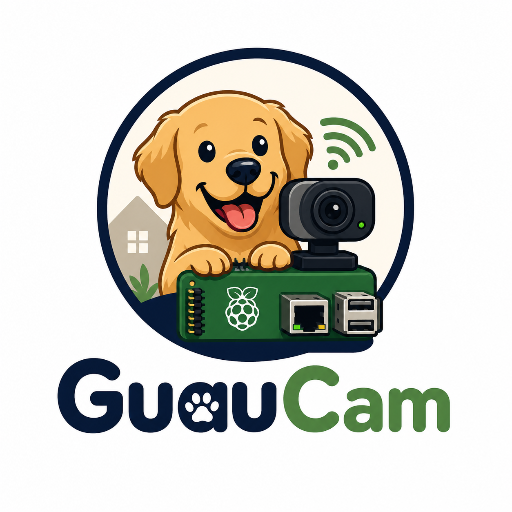

<div align="center">
  

# GuauCam

</div>

Watch your dogs from anywhere: real-time streaming from a camera (USB webcam or CSI ribbon module) connected to a Raspberry Pi Zero W, privately reachable through [Tailscale](https://tailscale.com), with Telegram alerts when they bark too much. Several people (you plus family) can be registered, and the bot answers on-demand commands like `/screenshot` and `/video`.

Everything installs with a single script (`install.sh`) and works without opening any ports to the outside: the video is only visible from your Tailscale network or your home WiFi.

## How it works

```
[USB or CSI camera] --MJPEG--> [Pi Zero W: streamer] --HTTP--> [Your phone/PC via Tailscale]
      |
      └--audio (USB mic)--> [Noise detector] --above threshold--> [Telegram alert + photo]
                                  |                                 (to every registered chat)
                                  ├--> [Web panel: video + live meter + settings]
                                  └--> [Telegram bot: /screenshot /video /live commands]
```

- **Video**: the CPU never compresses — essential on the Zero W's single ARMv6 core. With a USB webcam, the camera itself delivers MJPEG and the Pi just relays the frames ([ustreamer](https://github.com/pikvm/ustreamer)); with a CSI module, the VideoCore's *hardware* JPEG encoder compresses (picamera2). Either way: latency under 1 second, viewable in any browser. The installer detects which camera you have connected and asks which one to use if there are several.
- **Noise detector**: continuously measures the microphone volume (~3% CPU) — the USB webcam's, or a separate USB mic if you use a CSI module (which has none). If it stays above the configured threshold for several seconds in a row, it sends a Telegram message with a photo of the moment to every registered chat. Without a microphone, video and panel keep working; there's just no meter and no alerts.
- **Telegram bot**: the same bot also answers on-demand commands from any registered chat — `/screenshot` (a still now), `/video` (a few-seconds GIF clip), `/live` (link to the panel) and `/help`. A chat that is not registered is refused (the bot replies with its own `chat_id` so you can add it from the panel). No history is kept.
- **Web panel** (port 8081): the video (with a one-tap **Screenshot** download), the live noise level, and collapsible sections for the alert settings (threshold, duration, cooldown) and the Telegram setup (token, the list of registered chats with add/detect/remove, test message) — all on a single page, changes apply instantly with no restart. Without a microphone the noise controls hide behind a clear notice until one is plugged in. The live level arrives over a single SSE connection (no polling), and when the tab is hidden the panel pauses both the video download (~5-15 Mbps) and the level stream, resuming on return.
- **Access**: only through your tailnet (or the home LAN). Nothing exposed to the internet.

> [!NOTE]
> There is no recording and no history: the system is live viewing only. Audio is never transmitted or stored — the detector measures it and discards it. See [`CONTEXT.md`](CONTEXT.md) and [`docs/adr/`](docs/adr/) for the design decisions.

## Requirements

| What | Details |
|---|---|
| Raspberry Pi Zero W (v1) | With Raspberry Pi OS Lite 32-bit (Bookworm), fresh install, SSH enabled and connected to WiFi |
| Camera | **USB**: Logitech C920/C922 or any UVC webcam with native MJPEG. **CSI**: ribbon module Pi Camera / OV5647 type (note: the Pi Zero connector has 22 pins — modules shipping the standard 15-pin cable need the Zero adapter cable) |
| Microphone (for alerts) | The USB webcam's works. CSI modules have none: without a USB mic there are no noise alerts (video works anyway) |
| Tailscale account | With the app installed on the phone/PC you'll watch from |
| Telegram bot | For the noise alerts and the on-demand commands (free, 2 minutes — see below) |

## Installation

### 1. Create the Telegram bot (for the alerts)

1. On Telegram, talk to [@BotFather](https://t.me/BotFather) and send `/newbot`. Save the **token** it gives you.
2. **Send any message to your new bot** — the installer uses it to autodetect your `chat_id`.

### 2. Run the installer on the Pi

Over SSH, a single command — the installer downloads the rest of the code from this repository:

```bash
curl -fsSL https://github.com/AlexAdiaconitei/guaucam/raw/main/install.sh | sudo bash
```

(Alternative: `git clone` the repo and `sudo bash guaucam/install.sh`.)

The script:

1. Installs ustreamer, Tailscale and the dependencies.
2. **Detects the connected cameras** (USB and/or CSI); if there is more than one, it asks which to use. If you pick CSI, it installs `python3-picamera2`.
3. Clones this repository into `/opt/guaucam`.
4. Shows you a Tailscale URL — open it once to authorize the Pi on your tailnet.
5. Asks for the Telegram bot token (autodetects the `chat_id` if you already messaged the bot).
6. Asks for the stream and panel ports — press Enter to keep the defaults (`8080`/`8081`), or pick your own.
7. Leaves both services starting on boot, with automatic restart if anything fails.
8. When done, prints the chosen camera, your access URLs and sends a test message to your Telegram.

Swapping cameras later? Connect it and re-run the installer: it detects them again (or edit `CAMERA_TYPE` in `/etc/guaucam.conf` and restart `guaucam-stream`).

### Updating

Re-run the installer: it does a `git pull` of the new code and restarts the services **without touching your configuration** (`/etc/guaucam.conf` is kept).

```bash
sudo bash /opt/guaucam/install.sh
```

> [!TIP]
> You can leave the token empty during installation (or if the `chat_id` autodetection fails): video works anyway. Later, on the web panel, **Telegram alerts** section: save the token, send any message to your bot and press **Detect chat_id**. It activates instantly, no restart.
>
> To register **more people** (family), have each of them message the bot once, then press **Detect chat_id** on the panel to add them, or paste their `chat_id` and press **Add**. Everyone on the list gets the alerts and can use the bot commands. Remove anyone with the ✕ on their chip.

## Usage

### Watching the pups

Open in any browser (phone or PC, at home or away with Tailscale on):

| URL | What it is |
|---|---|
| `http://<pi-hostname>:8081/` | **Panel**: video + noise meter + settings (MagicDNS) |
| `http://<pi-hostname>:8080/` | Live stream only |
| `http://<pi-hostname>:8080/snapshot` | Still photo of the current instant |

(They also work with the Tailscale IP instead of the name.)

### Telegram bot commands

From any registered chat, send the bot:

| Command | What it does |
|---|---|
| `/screenshot` (or `/photo`) | A still photo of the current instant |
| `/video` | A short clip of the last few seconds, as a GIF |
| `/live` | The panel link to open the real-time feed (Telegram can't embed the live stream, so it can only link you to it) |
| `/help` | The list of commands |

Only registered chats are served; anyone else gets their own `chat_id` back so you can add them from the panel. The clip is a downscaled, silent, low-frame-rate GIF — enough for a quick "what's going on right now" without straining the Zero W's WiFi.

### Calibrating the noise threshold

The default (`-25` dB) is an estimate. The first time, open the **panel** (`http://<pi-hostname>:8081/`):

1. Watch where the level bar sits with your home's normal noise.
2. Make noise (or wait for some barking) and watch how far it goes.
3. Set the threshold in between — the yellow marker on the meter shows where it is. Save: it applies instantly.

<details>
<summary>SSH alternative (no browser)</summary>

```bash
sudo systemctl stop guaucam-detector
python3 /opt/guaucam/src/noise_detector.py --monitor
# watch the dB, edit THRESHOLD_DB in /etc/guaucam.conf and:
sudo systemctl start guaucam-detector
```

</details>

### Repository layout

```
install.sh                    # installer: detects the camera, downloads the repo and sets everything up
src/
├── stream.sh                 # starts the streamer for CAMERA_TYPE (usb→ustreamer, csi→stream_csi.py)
├── stream_csi.py             # MJPEG stream for CSI modules (picamera2 + hardware encoder)
├── noise_detector.py         # noise detector + panel server
├── panel.html                # web panel page
├── guaucam.conf              # configuration template (→ /etc/guaucam.conf)
├── guaucam-stream.service    # systemd unit for the stream
└── guaucam-detector.service  # systemd unit for the detector
CONTEXT.md                    # domain glossary
docs/adr/                     # architecture decision records
```

> [!IMPORTANT]
> The Telegram token is **never** stored in the repository: it lives only in `/etc/guaucam.conf` inside the Pi (with `600` permissions). That's why the repo can be public.

### Configuration

The threshold, the sustained duration, the cooldown and Telegram (token and the list of registered chats) are changed from the web panel with no restart. Everything else lives in `/etc/guaucam.conf`; after editing it, restart the services:

```bash
sudo systemctl restart guaucam-stream guaucam-detector
```

| Variable | Default | What it controls |
|---|---|---|
| `CAMERA_TYPE` | *(detected by the installer)* | `usb` (UVC webcam → ustreamer) or `csi` (ribbon module → picamera2) |
| `VIDEO_DEVICE` | *(detected by the installer)* | Webcam device — only used with `CAMERA_TYPE=usb` |
| `RESOLUTION` | `1280x720` | Video resolution (1080p doesn't fit in the Zero W's 2.4GHz WiFi) |
| `FPS` | `15` | Frames per second |
| `PORT` | `8080` | Stream port (the installer asks; re-run it or edit here to change) |
| `PANEL_PORT` | `8081` | Web panel port (same) |
| `THRESHOLD_DB` | `-25` | Noise level (dBFS) above which it counts as "barking too much" |
| `SUSTAINED_SECONDS` | `3` | Seconds in a row above the threshold before alerting (filters knocks and clicks) |
| `COOLDOWN_SECONDS` | `300` | Minimum between alerts — 20 minutes of barking won't send 200 messages |
| `AUDIO_DEVICE` | `auto` | Mic to use; `auto` finds the first USB mic (the webcam's, or a separate one with a CSI camera) |

> [!WARNING]
> The detector measures **volume**, it doesn't recognize barking: a vacuum cleaner or construction noise can also trigger the alert. The threshold and the sustained duration filter most false positives.

## Troubleshooting

```bash
# Service status
systemctl status guaucam-stream guaucam-detector

# Live logs
journalctl -u guaucam-stream -u guaucam-detector -f

# Is the Pi on the tailnet?
tailscale status
```

- **No stream (USB webcam)**: check it's plugged in (`ls /dev/video*`) and look at `journalctl -u guaucam-stream`.
- **No stream (CSI module)**: check the kernel sees the sensor (`dmesg | grep -iE 'unicam|ov5647'`). If it's not there: check the ribbon and its orientation (contacts facing the board) and remember the Pi Zero uses a 22-pin connector — the standard 15-pin cable does not fit, you need the Zero adapter cable. After reseating, reboot the Pi.
- **The panel shows "—" as the noise level**: no microphone. CSI modules have none; plug in a USB mic (or the webcam) and the meter starts by itself within a minute.
- **No Telegram alerts**: on the panel, Telegram alerts section, check it says "active" and press **Send test to all**. If the chat list is empty: send any message to your bot and press **Detect chat_id**.
- **Bot doesn't answer `/screenshot`**: the chat must be registered (check the chip list on the panel) and the token saved. Send the bot any message, press **Detect chat_id** to add yourself, and retry.
- **Choppy video away from home**: lower `RESOLUTION` to `800x600` or `FPS` to `10` — the Zero W's 2.4GHz WiFi gives ~20-30 Mbps real and each simultaneous viewer takes 5-15 Mbps.
